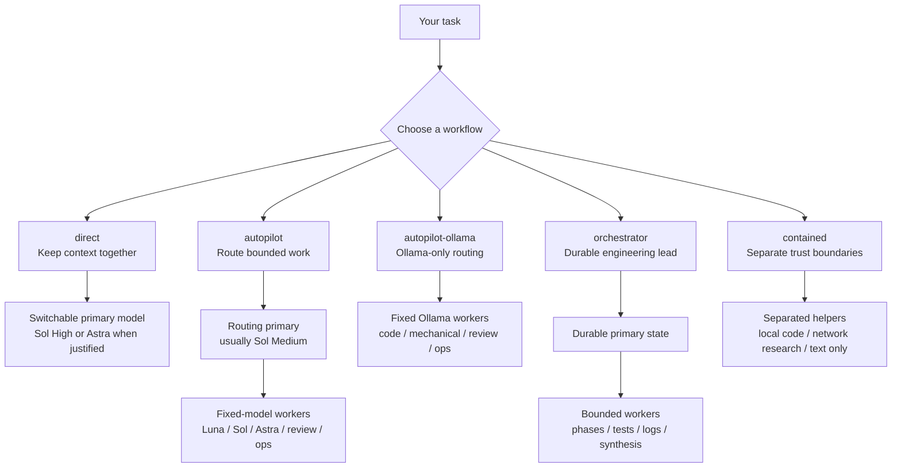

# opencode-agents

Reusable, opinionated agent definitions for OpenCode 2.

Primary agents describe **how work should be performed**. Model choice is separate because OpenCode lets you switch the active model for a primary session. Model-specific names are used mainly for subagents whose model must be fixed when delegated.

Copy the agents you want into `~/.config/opencode/agents/` or a project's `.opencode/agents/` directory, then review their models and permissions.

## How it works

Choose the workflow based on how you want work performed, then choose the primary model based on task difficulty. Delegated workers use fixed models so routing stays predictable.



## Quick start

For most engineering work:

```text
direct + Sol High
```

For a request where you want OpenCode to decide what should be delegated:

```text
autopilot + Sol Medium
```

For routed engineering that must stay entirely on Ollama:

```text
autopilot-ollama
```

For a durable workstream where one primary should own planning, delegated execution, and acceptance over time:

```text
orchestrator + Sol Medium
```

Use Sol High for the orchestrator when difficult architecture, diagnosis, or tradeoff reasoning belongs in that durable primary context.

Choose the workflow first, then change the primary model when the task justifies it.

## Primary workflows

| Agent | Use it when |
| --- | --- |
| `direct` | You want one model to own the engineering task and preserve implementation, debugging, and validation context |
| `autopilot` | You want the primary to inspect the repository, make small direct changes, and route substantive work to workers |
| `autopilot-ollama` | You want general routed engineering to remain entirely on Ollama-backed models without consuming OpenAI inference credits |
| `orchestrator` | You want one durable engineering lead to own architecture, planning, sequencing, delegated work, and acceptance across a workstream |
| `contained` | You need separation between local execution and internet research |
| `gated-direct` | You want direct engineering with approval-gated shell and external-directory access |
| `tutor` | You want Socratic programming and engineering tutoring |
| `yolo` | You intentionally want high-authority direct execution |

The default model in a primary file is only a starting point. A primary workflow can be loaded and then switched to another model without needing another agent definition.

## Primary model selection

Use **Sol High for normal substantive engineering and long-lived direct sessions**. Use **Sol Medium for routing and execution-oriented orchestration** where the primary mainly decomposes, integrates, and accepts work. Use **Sol High** for an orchestrator whose own context must carry difficult architecture, diagnosis, or consequential tradeoff reasoning.

Do not raise reasoning effort globally as a generic quality switch. Higher effort can buy additional verification and problem solving, but it also increases token use, latency, and context pressure. Spend the extra intelligence in bounded work where the task or risk justifies it.

| Model | Recommended use |
| --- | --- |
| Luna High | Cheap, straightforward, bounded utility work where substantial design judgment is not required |
| Sol Medium | Routing, orchestration, planning, and control-plane work |
| Sol High | Default substantive engineering, interactive direct work, difficult diagnosis, and independent review |
| Astra Low | First premium escalation for hard or subtle engineering where additional capability is likely to matter |
| Astra Medium | Exceptional security-sensitive, concurrent, stateful, protocol, data-integrity, compatibility, architectural, or high-consequence work |

Practical defaults:

```text
Normal interactive engineering  direct + Sol High
Hard coding                     direct + Astra Low
Very hard/consequential code    direct + Astra Medium

Normal routed work              autopilot + Sol Medium
Difficult planning/routing      autopilot + Sol High
Ollama-only routed work         autopilot-ollama

Execution-oriented workstream   orchestrator + Sol Medium
Architecture-heavy workstream    orchestrator + Sol High
```

For mature codebases, optimize for **quality per accepted change**, not inference cost alone. A cheaper model is not a win if it creates unnecessary abstractions, tests, wrappers, cleanup, or follow-up work. Conversely, a higher reasoning level is not a win when it adds substantial tokens and latency without materially changing the accepted result.

Grok remains outside the normal repository coding ladder. When available, use Grok 4.7 High manually with `direct` for a fresh independent perspective, especially when the current model may be stuck on one framing. Do not add it to automatic routing merely because credits are available.

## Context locality and delegation

Long-lived primary sessions can accumulate valuable conversation history, repository discoveries, debugging evidence, and user decisions. Stable repeated prefixes may also benefit from provider prompt caching. Treat that as an efficiency benefit, not a correctness guarantee, and avoid unnecessary context resets.

For `autopilot` and `orchestrator`, delegate bounded work when the parent can accept a compact result without losing decision-critical context. Delegation is especially useful when:

- noisy or long-running output can be kept out of the primary context;
- independent reasoning is intentionally valuable;
- a specialist or permission boundary is the reason for delegation;
- genuinely independent work can proceed in parallel; or
- a cohesive bounded worker can own the outcome without needing most of the parent's accumulated reasoning.

Keep work in the current session when doing it there materially builds context needed for architecture, sequential implementation decisions, ambiguous debugging, acceptance, or later user discussion. Trivial reads and concise commands also do not need a child when delegation would add more overhead than value.

A delegated task is a persistent work context, not a one-shot call. Retain its returned `task_id` and resume it for directly related corrections while that context remains useful. Start fresh for a materially different outcome or intentionally independent reasoning. Do not fragment one cohesive implementation into planner, coder, reviewer, and validator sessions by default.

## Delegated workers

Subagents keep fixed models so routing remains deterministic.

| Agent | Fixed role |
| --- | --- |
| `luna-runner` | GPT-6 Luna High utility worker for commands, tests, docs, simple configuration, and mechanical edits |
| `sol-code` | GPT-6 Sol High default delegated software-engineering worker |
| `astra-code` | Astra Low first premium engineering escalation |
| `astra-code-medium` | Astra Medium exceptional/high-consequence engineering worker |
| `sol-review` | GPT-6 Sol High independent read-only review |
| `coder-ollama` | Cost-first Ollama implementation worker for bounded low-risk coding |
| `general-lite-ollama` | Cheap Ollama mechanical/configuration worker |
| `review-ollama` | Cost-first Ollama reviewer; not the high-risk review tier |
| `ops-fast` | Short operational checks and focused commands |
| `ops-context` | Long tests, logs, repository synthesis, and other noisy context-heavy work |
| `ops-autopilot-ollama` | Intentionally large operational sub-workstream manager |
| `github` | Git and GitHub lifecycle specialist |
| `config` | OpenCode 2 configuration specialist |
| `cloudflare-expert` | Cloudflare infrastructure specialist |

Containment also uses `contained-code-local`, `contained-net-research`, and `contained-text-only` as trust-boundary helpers.

## How the main workflows differ

### `direct`

Use this when you want to work with one model over time. It can inspect and discuss the repository without mutating it during exploration, then preserve the accumulated context when you decide to implement. It may offload mechanical or noisy work, but substantive implementation, architectural decisions, ambiguous debugging, and final judgment stay in the primary session.

This is the normal choice when context preservation matters.

### `autopilot`

Use this when you want the primary to decide how the work should be performed. It can inspect the repository, understand files directly, update plans or documentation, make small obvious edits, and delegate substantive implementation to fixed-model workers.

Typical routing:

```text
mechanical work            -> luna-runner
normal engineering         -> sol-code
hard/subtle engineering    -> astra-code
exceptional/high-risk code -> astra-code-medium
independent review         -> sol-review
short operational work     -> ops-fast
large/noisy context        -> ops-context
```

This is not an automatic escalation ladder. Route directly to the cheapest worker that is likely to produce an acceptable result given the task shape and consequence of being wrong.

### `autopilot-ollama`

Use this when you want the same general routing pattern but intentionally want the entire model path to remain on Ollama-backed agents.

Typical routing:

```text
bounded implementation      -> coder-ollama
mechanical/config work      -> general-lite-ollama
independent cheap review    -> review-ollama
short operational work     -> ops-fast
large/noisy context        -> ops-context
large operational work     -> ops-autopilot-ollama
OpenCode configuration     -> config
```

It has no permission to delegate to OpenAI-backed workers. If the task develops security-sensitive behavior, subtle concurrency/state, consequential architecture, difficult protocol or compatibility constraints, data-integrity risk, or material unresolved uncertainty, it should stop and report the escalation need rather than silently consuming premium credits.

### `orchestrator`

Use this when the primary session itself should be the durable engineering lead. Architecture discussion, planning, diagnosis, sequencing, acceptance, and user decisions stay in this context while bounded implementation and evidence work are delegated.

It may read and edit files directly. The boundary is behavioral, not tool-based: personally absorb information when understanding it matters to later decisions, and delegate broad inventory, routine implementation, repetitive work, and noisy validation when a compact result is enough. Sustained application implementation and debugging loops should usually stay with one cohesive coding worker.

Retain worker `task_id` values until their outcomes are accepted or abandoned. Resume the same worker for directly related corrections; use a fresh task for a new tranche or intentional independent review. Push verbose tests, logs, broad repository inventory, external research, and other context-heavy work into bounded workers and retain compact evidence in the durable primary context.

## Design

- Optimize for accepted code quality, not raw inference cost alone.
- Use Sol High as the normal substantive engineering default, Sol Medium for routing and execution-oriented orchestration, and Sol High when the durable orchestrator itself owns difficult architecture or diagnosis.
- Use `luna-runner` for clearly mechanical cheap work.
- Use Astra Low when extra intelligence is likely to affect the accepted change, and Astra Medium only when concrete risk or complexity warrants it.
- Keep xHigh and Max manual and exceptional rather than normal agent defaults.
- Prefer one cohesive worker over chains of planners, coders, reviewers, and validators.
- Primary orchestrators may read files, run useful commands, update plans and docs, change configuration, and make small obvious edits.
- Preserve useful warm context. In `autopilot` and `orchestrator`, delegate bounded execution and evidence by default when a compact result is sufficient; keep decision-critical architecture, tradeoffs, diagnosis, and acceptance in the primary context.
- Offload long tests, logs, and broad synthesis so premium engineering context stays focused.
- Use independent review only when risk or uncertainty justifies a separate reasoning path.
- Keep trust boundaries explicit. Contained agents separate local code authority from internet research.
- Keep project-specific workflow policy in the repository's canonical guidance.
  Use `AGENTS.md` to direct agents to it; use project-local configuration for
  capabilities and skills for specialized execution details, not policy copies.

## Nested orchestration

Keep managers top-level. `orchestrator` is a primary workflow, not a normal child agent. The standard depth-two topology is `orchestrator -> coding worker -> utility worker`, with independent review and Git lifecycle owned by the orchestrator. `ops-autopilot-ollama` remains available only for a deliberately large bounded operational sub-workstream.

Extra delegation layers should buy real context isolation or useful fan-out rather than becoming the default path.

## Permissions

Agent files use OpenCode 2 permission rules with `action`, `resource`, and `effect`. Common destructive operations are denied, external-directory access is limited or approval-gated, and contained profiles use stricter separation.

Command blacklists are guardrails, not strong sandboxing. Use contained or external isolation when a real security boundary is required.
