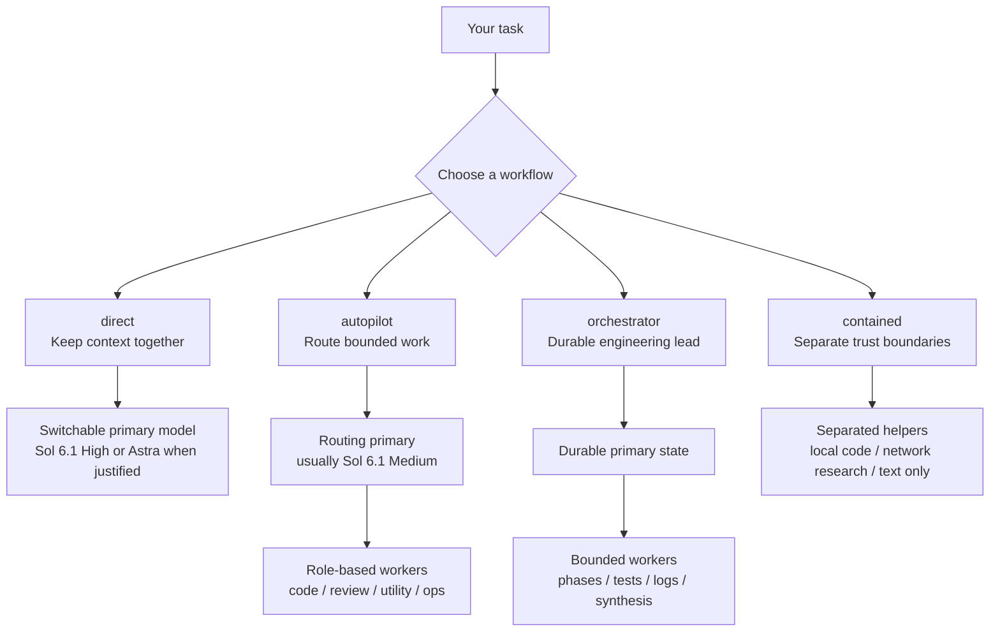

# opencode-agents

Reusable, opinionated agent definitions for OpenCode 2.

Primary agents describe **how work should be performed**. Worker agents describe **what role a delegated task performs**. Model choice is separate: primaries can be switched interactively, and approved child-model overrides let `autopilot` and `orchestrator` use the same worker role at different capability levels.

Copy the agents you want into `~/.config/opencode/agents/` or a project's `.opencode/agents/` directory, then review their models and permissions.

## How it works

Choose the workflow based on how you want work performed, then choose the primary model based on task difficulty. Delegated roles have sensible default models; `autopilot` and `orchestrator` may override the child model only within the approved routing set.


```mermaid
flowchart TD
    T["Your task"] --> W{"Choose a workflow"}

    W --> D["direct<br/>Keep context together"]
    W --> A["autopilot<br/>Route bounded work"]
    W --> O["orchestrator<br/>Durable engineering lead"]
    W --> C["contained<br/>Separate trust boundaries"]

    D --> P["Switchable primary model<br/>Sol 6.1 High or Astra when justified"]

    A --> R["Routing primary<br/>usually Sol 6.1 Medium"]
    R --> F["Role-based workers<br/>code / review / utility / ops"]


    O --> DS["Durable primary state"]
    DS --> BW["Bounded workers<br/>phases / tests / logs / synthesis"]

    C --> TB["Separated helpers<br/>local code / network research / text only"]
```

## Quick start

For most interactive engineering work:

```text
direct + Sol 6.1 High
```

For a request where you want OpenCode to decide what should be delegated:

```text
autopilot + Sol 6.1 Medium
```

For a durable workstream where one primary should own planning, delegated execution, and acceptance over time:

```text
orchestrator + Sol 6.1 Medium
```

Use Sol 6.1 High for the orchestrator when difficult architecture, diagnosis, or tradeoff reasoning belongs in that durable primary context. Switch the primary itself to Astra Medium only when that parent context contains exceptional or high-consequence judgment that should not be thrown away in a fresh child.

Choose the workflow first, then change the primary model when the task justifies it.

## Primary workflows

| Agent | Use it when |
| --- | --- |
| `direct` | You want one model to own the engineering task and preserve implementation, debugging, and validation context |
| `autopilot` | You want the primary to inspect the repository, make small direct changes, and route substantive work to workers |
| `orchestrator` | You want one durable engineering lead to own architecture, planning, sequencing, delegated work, and acceptance across a workstream |
| `contained` | You need separation between local execution and internet research |
| `gated-direct` | You want direct engineering with approval-gated shell and external-directory access |
| `tutor` | You want Socratic programming and engineering tutoring |
| `yolo` | You intentionally want high-authority direct execution |

The default model in a primary file is only a starting point. A primary workflow can be loaded and then switched to another model without needing another agent definition.

## Primary model selection

Use **GPT-6.1 Sol High for normal interactive substantive engineering and long-lived direct sessions**. Use **GPT-6.1 Sol Medium for routing, normal delegated implementation, and execution-oriented orchestration**. Use **GPT-6.1 Sol High** when the task is hard or subtle enough that deeper debugging or design judgment is likely to change the accepted result. Use **Astra Medium** for exceptional/high-consequence work, not simply because a task is nontrivial.

Do not raise reasoning effort globally as a generic quality switch. Higher effort can buy additional verification and problem solving, but it also increases token use, latency, and context pressure. Spend the extra intelligence in bounded work where the task or risk justifies it.

| Model | Recommended use |
| --- | --- |
| Luna Medium | Cheap, short-lived, bounded utility work where substantial design judgment is not required |
| GPT-6.1 Sol Medium | Routing, orchestration, normal delegated coding, planning, and control-plane work |
| GPT-6.1 Sol High | Interactive substantive engineering, hard/subtle implementation, difficult diagnosis, and normal independent review |
| Astra Medium | Exceptional security-sensitive, concurrent, stateful, protocol, data-integrity, compatibility, destructive-operation, architectural, or high-consequence work and review |
| Grok 4.7 High | Manual `direct` alternative when an independent perspective, different implementation approach, or fresh debugging frame is valuable |

Practical defaults:

```text
Normal interactive engineering  direct + Sol 6.1 High
Hard interactive engineering    direct + Sol 6.1 High
Exceptional/consequential work  direct + Astra Medium
Independent second approach     direct + Grok 4.7 High

Normal routed work              autopilot + Sol 6.1 Medium
Difficult planning/routing      autopilot + Sol 6.1 High

Execution-oriented workstream   orchestrator + Sol 6.1 Medium
Architecture-heavy workstream   orchestrator + Sol 6.1 High
Exceptional parent judgment     orchestrator + Astra Medium
```

For mature codebases, optimize for **quality per accepted change**, not inference cost alone. A cheaper model is not a win if it creates unnecessary abstractions, tests, wrappers, cleanup, or follow-up work. Conversely, a higher reasoning level is not a win when it adds substantial tokens and latency without materially changing the accepted result.

Grok remains outside the normal repository coding ladder. Use Grok 4.7 High manually with `direct` when a fresh independent perspective, different implementation strategy, or alternate debugging frame is useful, especially when Sol appears anchored on one approach. Do not add Grok to automatic routing, the normal delegated coding ladder, or the default orchestrator path. Prefer High for routine Grok use; keep xHigh manual for unusually difficult bounded problems where the extra reasoning cost is explicitly justified.

## Context locality and delegation

Long-lived primary sessions can accumulate valuable conversation history, repository discoveries, debugging evidence, and user decisions. Stable repeated prefixes may also benefit from provider prompt caching. Treat that as an efficiency benefit, not a correctness guarantee, and avoid unnecessary context resets.

For `autopilot` and `orchestrator`, delegate bounded work when the parent can accept a compact result without losing decision-critical context. Delegation is especially useful when:

- noisy or long-running output can be kept out of the primary context;
- independent reasoning is intentionally valuable;
- a specialist or permission boundary is the reason for delegation;
- genuinely independent work can proceed in parallel; or
- a cohesive bounded worker can own the outcome without needing most of the parent's accumulated reasoning.

Keep work in the current session when doing it there materially builds context needed for architecture, sequential implementation decisions, ambiguous debugging, acceptance, or later user discussion. Trivial reads and concise commands also do not need a child when delegation would add more overhead than value.

A delegated task is a persistent work context, not a one-shot call. Retain its returned `task_id` and resume it for directly related corrections while that context remains useful. Start fresh for a materially different outcome or intentionally independent reasoning. Do not fragment one cohesive implementation into planner, coder, reviewer, and validator sessions by default.

## Delegated workers

Worker names describe role and permissions, not the model tier. Defaults keep common routing simple, while approved child-model overrides let the same role scale up without duplicating agent definitions.

| Agent | Default model | Role |
| --- | --- | --- |
| `utility` | GPT-6 Luna Medium | Mechanical edits, docs, simple configuration, extraction, and focused validation |
| `code` | GPT-6.1 Sol Medium | Cohesive software engineering and debugging; may be overridden to Sol High or Astra Medium |
| `review` | GPT-6.1 Sol High | Independent read-only review; may be overridden to Astra Medium |
| `ops-fast` | GPT-6 Luna High | Short operational checks and focused commands |
| `ops-context` | GPT-6.1 Sol Medium | Long tests, logs, repository synthesis, and noisy context-heavy work |
| `github` | GPT-6.1 Sol Medium | Git and GitHub lifecycle specialist |
| `config` | GPT-6.1 Sol Medium | OpenCode 2 configuration specialist |
| `cloudflare-expert` | GPT-6.1 Sol High | Cloudflare infrastructure specialist |

The automatic child-model allowlist is Luna Medium, Luna High, Sol Medium, Sol High, and Astra Medium. Do not automatically select another provider, model, or variant. Grok 4.7 High remains a manual `direct` choice.

Containment also uses `contained-code-local`, `contained-net-research`, and `contained-text-only` as trust-boundary helpers. Those helpers inherit the selected `contained` model unless explicitly overridden.


## Explicit worker model overrides

The worker role and the model are separate choices. `code` still means implementation and `review` still means read-only review even when you explicitly run that role with a different provider or model.

OpenCode only accepts models that are available in the current project. Use `/models` to select or confirm the exact provider/model ID instead of guessing it.

Examples of user instructions:

```text
Use the review agent with Grok 4.7 High to review the current changes.

Delegate this implementation to the code agent using GLM-5.3.

For this task, use GLM-5.3-Flash for utility and short operational work.

Run the normal review again, but use <provider>/<grok-4.7-model>#high instead of the default Sol model.
```

For a longer workstream you can set a temporary routing preference in the request:

```text
For this workstream:
- use GLM-5.3 for code tasks
- use GLM-5.3-Flash for utility or short operational tasks
- use Grok 4.7 High for the independent review

Keep the existing agent roles and permissions.
```

Replace the example model names with the exact IDs shown by `/models` in your environment. A model explicitly requested by the user may be used even when it is outside this repository's automatic routing allowlist. The allowlist limits autonomous model selection; it does not prevent an explicit user-selected child-model override.


## How the main workflows differ

### `direct`

Use this when you want to work with one model over time. It can inspect and discuss the repository without mutating it during exploration, then preserve the accumulated context when you decide to implement. It may offload mechanical or noisy work, but substantive implementation, architectural decisions, ambiguous debugging, and final judgment stay in the primary session.

This is the normal choice when context preservation matters.

### `autopilot`

Use this when you want the primary to decide how the work should be performed. It can inspect the repository, understand files directly, update plans or documentation, make small obvious edits, and delegate substantive work to role-based workers.

Typical routing:

```text
mechanical work             -> utility (Luna Medium)
normal engineering          -> code (Sol Medium)
hard/subtle engineering     -> code + Sol High override
exceptional/high-risk code  -> code + Astra Medium override
independent review          -> review (Sol High)
high-consequence review     -> review + Astra Medium override
short operational work      -> ops-fast
large/noisy context         -> ops-context
```

This is not an automatic escalation ladder. Route directly to the cheapest worker that is likely to produce an acceptable result given the task shape and consequence of being wrong.


### `orchestrator`

Use this when the primary session itself should be the durable engineering lead. Architecture discussion, planning, diagnosis, sequencing, acceptance, and user decisions stay in this context while bounded implementation and evidence work are delegated.

It may read and edit files directly. The boundary is behavioral, not tool-based: personally absorb information when understanding it matters to later decisions, and delegate broad inventory, routine implementation, repetitive work, and noisy validation when a compact result is enough. Sustained application implementation and debugging loops should usually stay with one cohesive coding worker.

Retain worker `task_id` values until their outcomes are accepted or abandoned. Resume the same worker for directly related corrections; use a fresh task for a new tranche or intentional independent review. Push verbose tests, logs, broad repository inventory, external research, and other context-heavy work into bounded workers and retain compact evidence in the durable primary context.

## Design

- Optimize for accepted code quality, not raw inference cost alone.
- Use GPT-6.1 Sol Medium for routing, the default `code` worker, and execution-oriented orchestration.
- Use GPT-6.1 Sol High for interactive substantive engineering, hard/subtle `code` overrides, difficult diagnosis, and the default `review` worker.
- Use `utility` for clearly mechanical, short-lived work.
- Use Astra Medium only when concrete consequence, risk, or unresolved complexity warrants it; Astra Low is not part of the automatic coding ladder.
- Keep Astra High, xHigh, and Max manual and exceptional rather than normal agent defaults.
- Prefer one cohesive worker over chains of planners, coders, reviewers, and validators.
- Primary orchestrators may read files, run useful commands, update plans and docs, change configuration, and make small obvious edits.
- Preserve useful warm context. In `autopilot` and `orchestrator`, delegate bounded execution and evidence by default when a compact result is sufficient; keep decision-critical architecture, tradeoffs, diagnosis, and acceptance in the primary context.
- Offload long tests, logs, and broad synthesis so engineering context stays focused.
- Use independent review only when risk or uncertainty justifies a separate reasoning path.
- Keep trust boundaries explicit. Contained agents separate local code authority from internet research.
- Keep project-specific workflow policy in the repository's canonical guidance.
  Use `AGENTS.md` to direct agents to it; use project-local configuration for
  capabilities and skills for specialized execution details, not policy copies.

## Nested orchestration

Keep managers top-level. `orchestrator` is a primary workflow, not a normal child agent. The standard depth-two topology is `orchestrator -> code -> utility/ops`, with independent `review` and Git lifecycle owned by the orchestrator.

Extra delegation layers should buy real context isolation or useful fan-out rather than becoming the default path.

## Permissions

Agent files use OpenCode 2 permission rules with `action`, `resource`, and `effect`. Common destructive operations are denied, external-directory access is limited or approval-gated, and contained profiles use stricter separation.

Command blacklists are guardrails, not strong sandboxing. Use contained or external isolation when a real security boundary is required.
